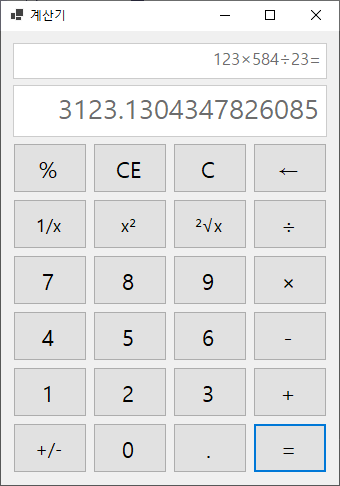
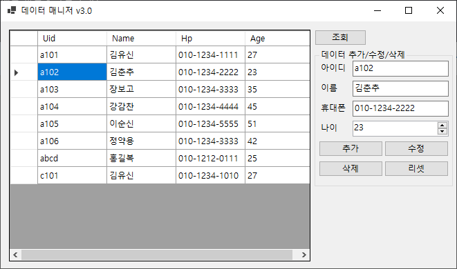
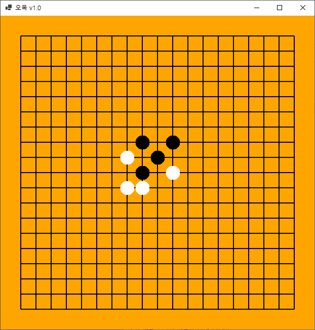
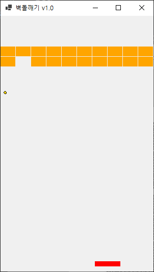

# C\#Study

## 제01장 CH01. HELLO WORLD
## 제02장 CH02. 변수와 자료형 그리고 연산자
	- 1. 변수
	- 2. 자료형
	- 3. 연산자
	- 4. 기본입력
	- 5. 자료형 변환
	- 6. 문자열

## 제03장 CH03. 조건문과 반복문 그리고 배열
	- 1. IF문
	- 2. SWITCH문
	- 3. FOR문
	- 4. WHILE문
	- 5. ARRAY문

## 제04장 CH04. 메서드
	- 1. 메서드
	- 2. 메서드 타입
	- 3. 메서드 오버로딩
	- 4. 메서드 스택
	- 5. 메서드 출력전용 매개변수

## 제05장 CH05. 클래스
	- 1. 클래스
	- 2. 캡슐화
	- 3. 클래스 변수, 메서드(정적 변수, 메서드) 그리고 싱글톤 객체
	- 4. 클래스 상속
	- 5. 오버라이드
	- 6. 다형성

## 제06장 CH06. 클래스 타입
	- 1. 추상 클래스
	- 2. 인터페이스
	- 3. 구조체
	- 4. 제네릭
	- 5. 인덱서
	- 6. 내부 클래스

## 제07장 CH07. 컬렉션
	- 1. 스택
	- 2. 큐
	- 3. 어래이리스트, 리스트
	- 4. 해쉬테이블, 딕셔너리
	- 5. 해쉬셋

## 제08장 CH08. 예외처리와 파일 입출력
	- 1. TRY-CATCH문
	- 2. THROW문
	- 3. 파일 입출력

## 제09장 CH09. 대리자와 LINQ
	- 1. 대리자
	- 2. 람다식
	- 3. LINQ

## 제10장 CH10. 데이터베이스
	- 1. DB연결
	- 2. INSERT문
	- 3. SELECT문

## 제11장 CH11. WINFORM
	- 1. 컨트롤과 이벤트 그리고 핸들러
	- 2. 데이터 공급과 표시
	- 3. 그림그리기와 타이머

## 쪽지시험 TEST

## Project1. 계산기

1. 프로젝트 유형
	- WinForm 프로젝트
2. 활용기술
	- 컨트롤
	- 이벤트와 핸들러

## Project2. 데이터 매니저

1. 프로젝트 유형
	- WinForm 프로젝트
2. 활용기술
	- 컨트롤
	- 이벤트와 핸들러
	- DB접속 및 쿼리

## Project3. 오목

1. 프로젝트 유형
	- WinForm 프로젝트
2. 활용기술
	- 컨트롤
	- 이벤트와 핸들러
	- 그림 그리기

## Project4. 벽돌깨기

1. 프로젝트 유형
	- WinForm 프로젝트
2. 활용기술
	- 컨트롤
	- 이벤트와 핸들러
	- 그림 그리기
	- 타이머

## 백준 문제풀이
